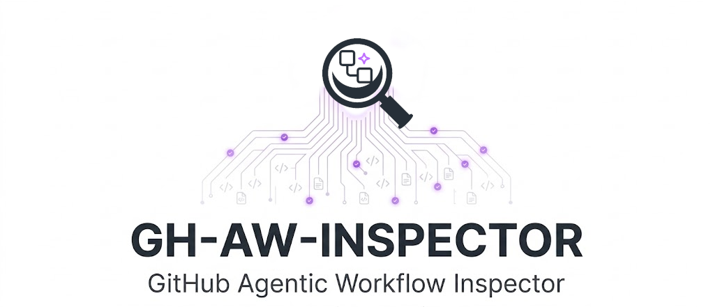
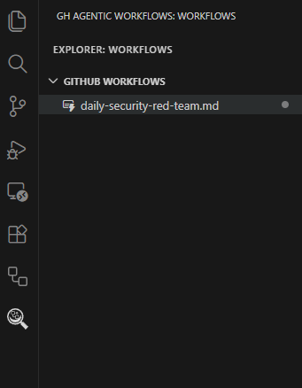
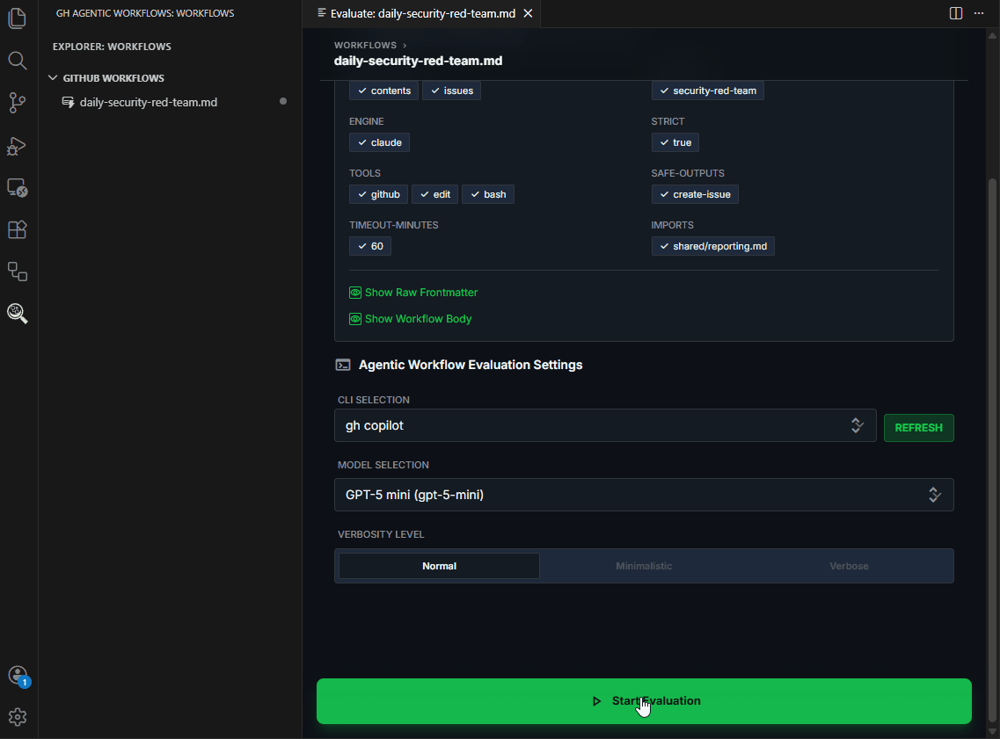
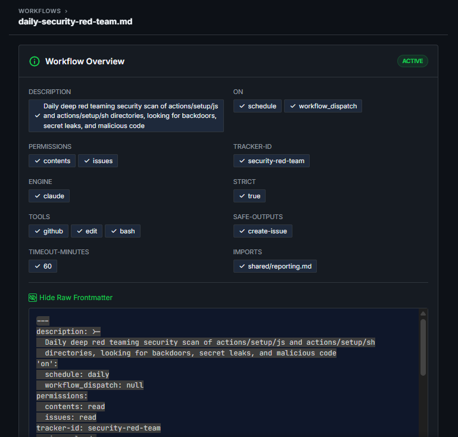

# GH AW Inspector

<div align="center">



**Inspect, simulate, and evaluate [GitHub Agentic Workflows](https://github.com/github/gh-aw) — without leaving VS Code.**

[](https://marketplace.visualstudio.com/items?itemName=petermefrandsen.gh-aw-inspector)
[](https://open-vsx.org/extension/petermefrandsen/gh-aw-inspector)
[](https://github.com/petermefrandsen/gh-aw-inspector/actions)
[](LICENSE)
[](https://github.com/petermefrandsen/gh-aw-inspector/actions)

</div>

---

## Overview

**GH AW Inspector** is a Visual Studio Code extension that brings the [GitHub Agentic Workflows CLI (`gh aw`)](https://github.com/github/gh-aw) into your editor. It provides a rich interface for discovering, inspecting, simulating, and evaluating AI-driven GitHub workflows — defined as Markdown files — directly inside VS Code.

GitHub Agentic Workflows let developers define tasks for AI agents in plain Markdown. GH AW Inspector is the **IDE companion** for that ecosystem: after you write and test a workflow with `gh aw trial` / `gh aw run`, use this extension to inspect runs, iterate on prompts, and generate structured evaluation reports.

---

## Features

### 🗂️ Workflow Discovery Sidebar
Automatically discovers all `.md` agentic workflow files in `.github/workflows/` and displays them in a dedicated sidebar panel.



---

### ▶️ One-Click Evaluation
Select any workflow from the sidebar and launch an evaluation session. GH AW Inspector runs the workflow using `gh aw run` and captures the output in real time.

Verbosity modes: Choose the level of detail included in evaluation reports — `minimalistic` (brief summary), `normal` (balanced details, default), and `verbose` (full metadata, rationale, and action items).


---

### 📝 Auto-Generated Evaluation Reports
Each evaluation produces a structured Markdown report covering:

| Section | Description |
|---------|-------------|
| **Description** | What the workflow ran |
| **Metadata** | Timestamps, model used, duration |
| **Prerequisites** | Required context or dependencies |
| **Intent** | The prompt goal |
| **Happy path output** | Successful execution example |
| **Unhappy path outputs** | Common failure cases |



---

### 🔍 Frontmatter Inspector
Parses and displays the `gh-aw` frontmatter schema from workflow files — engine, triggers, tools, permissions, and safe outputs — so you can understand a workflow at a glance without reading raw Markdown.



---

## Installation

### From the Marketplace (Recommended)

1. Open VS Code
2. Press `Ctrl+P` / `Cmd+P` and run:
   ```
   ext install petermefrandsen.gh-aw-inspector
   ```
3. Or search **"GH Agentic Workflows Inspector"** in the Extensions panel

### From Open VSX

Available at [open-vsx.org/extension/petermefrandsen/gh-aw-inspector](https://open-vsx.org/extension/petermefrandsen/gh-aw-inspector) for VS Code-compatible editors (VSCodium, Gitpod, etc.).

---

## Requirements

| Requirement | Version |
|-------------|---------|
| VS Code | `^1.90.0` |
| [GitHub CLI (`gh`)](https://cli.github.com/) | Latest |
| [gh-aw extension](https://github.com/github/gh-aw) | Latest |
| Node.js | 18+ |

Install the `gh-aw` CLI extension:
```bash
gh extension install github/gh-aw
```

---

## Quick Start

1. Open a repository that contains `.github/workflows/*.md` agentic workflow files
2. Click the **GH Agentic Workflows** icon in the Activity Bar
3. Your workflows appear in the sidebar — click one to inspect it
4. Press ▶️ **Start Evaluation** to run a simulation

---

## How It Works

```
.github/workflows/
  └── my-workflow.md        ← gh-aw agentic workflow (Markdown)

VS Code Sidebar
  └── GH Agentic Workflows
        └── my-workflow.md  ← discovered automatically
              └── ▶ Start Evaluation
                    └── gh aw run my-workflow
                          └── Evaluation Report (Markdown)
```

GH AW Inspector uses VS Code's file-system APIs to discover `*.md` files in `.github/workflows/`, then invokes the `gh aw` CLI for execution. The output is parsed and rendered as a structured report in the editor.

---

## Extension Settings

This extension contributes the following settings (coming soon):

| Setting | Default | Description |
|---------|---------|-------------|
| `gh-aw-inspector.cliPath` | `gh` | Path to the `gh` CLI binary |
| `gh-aw-inspector.defaultModel` | `copilot` | Default AI engine for simulations |
| `gh-aw-inspector.reportOutputDir` | `.gh-aw-reports` | Directory for generated evaluation reports |

---

## Repository Structure

```
gh-aw-inspector/
├── src/
│   ├── extension.ts          # Entry point — registers commands & sidebar
│   ├── sidebar/
│   │   └── SidebarProvider.ts # Workflow discovery & webview communication
│   ├── panels/
│   │   └── EvaluationPanel.ts # Evaluation webview panel
│   └── test/
│       ├── suite/             # Unit tests (Mocha)
│       └── e2e/               # E2E tests (vscode-extension-tester)
├── resources/                 # Extension icons
├── docs/
│   ├── architecture.md        # Technical architecture
│   ├── gh-aw-frontmatter.md   # gh-aw frontmatter schema reference
│   ├── design-guidelines.md   # UI/UX design principles
│   └── screenshots/           # Demo screenshots and GIFs
├── test-workspace/            # Workspace used by integration tests
│   └── .github/workflows/
│       └── daily-security-red-team.md
├── .github/
│   ├── workflows/
│   │   ├── auto-release.yml   # Auto-versioning + marketplace publish on PR merge
│   │   └── tests.yml          # CI — lint, type-check, unit + E2E tests
│   └── skills/                # Copilot CLI agent skills
└── CONTRIBUTING.md
```

---

## Development

See [CONTRIBUTING.md](CONTRIBUTING.md) for the full development guide.

### Quick Setup

```bash
# Clone
git clone https://github.com/petermefrandsen/gh-aw-inspector.git
cd gh-aw-inspector

# Install dependencies (uses pnpm)
pnpm install

# Build
pnpm run package

# Run tests
pnpm test
```

### Running in Development Mode

Press `F5` in VS Code to open the Extension Development Host with the extension loaded.

---

## Roadmap

- [x] Workflow discovery sidebar
- [x] Evaluation panel
- [x] Automated release pipeline (VS Marketplace + Open VSX)
- [ ] Evaluation report diffing between runs
- [ ] Multi-workspace support
- [ ] `gh aw compile` output preview

---

## Contributing

Contributions are welcome! Please read [CONTRIBUTING.md](CONTRIBUTING.md) first.

- 🐛 [Report a bug](https://github.com/petermefrandsen/gh-aw-inspector/issues/new?labels=bug)
- 💡 [Request a feature](https://github.com/petermefrandsen/gh-aw-inspector/issues/new?labels=enhancement)
- 📖 [Improve documentation](https://github.com/petermefrandsen/gh-aw-inspector/issues/new?labels=documentation)

---

## License

[MIT](LICENSE) © 2026 Peter M E Frandsen

